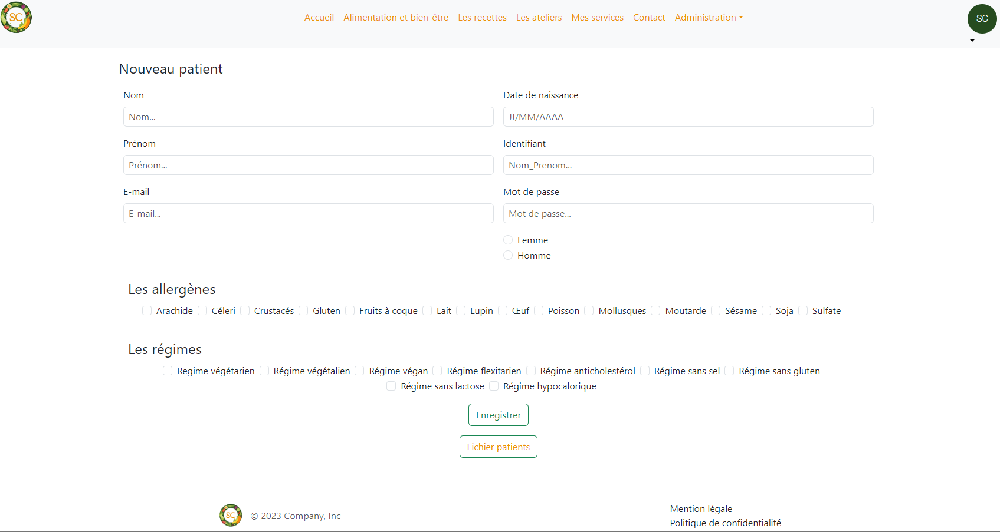

ECF Sandrine Coupart
==============



Ce dépôt comprend :
* Le code en PHP 8
* Une base de données mariaDB 
* Du html5 et css3


Pré-requis
----------

* Une base de données MySQL ou mariaDB
* Un serveur web apache2
* PHP > = V8


Installation
------------

synchroniser le code php dans le repertoire root de apache
   $ git clone git@github.com:Estelle-Berger/Sandrine_Coupart.git
   
importer la bdd 
   $ mysql -u $user -p $database_name < import.sql
```
Changelog
=========

## [1.0.0] - 2024-01-25

- Version initiale
                     

Copyright 
====================


Copyright © 2024 Estelle BERGER – esteleberger13@gmail.com
